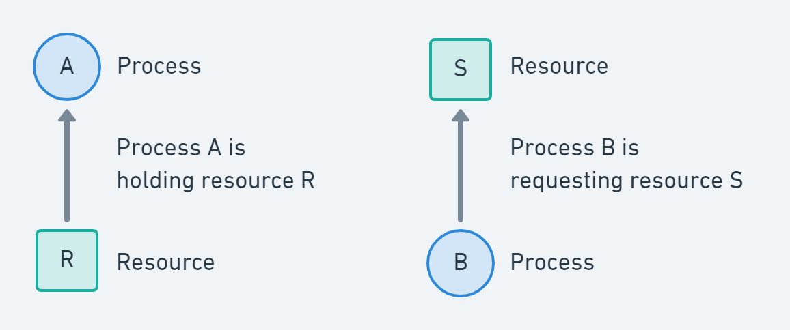
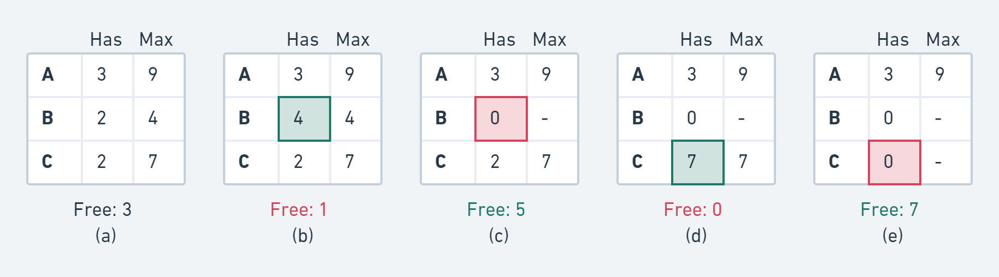
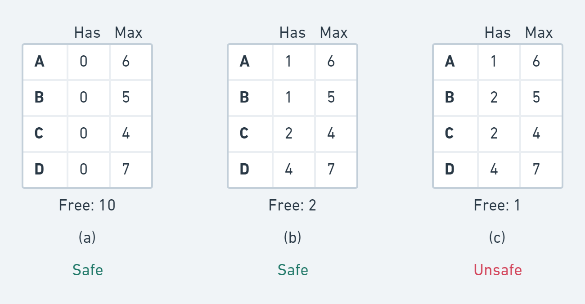

# Concurrency

## Inter-Process Communication (IPC)

Processes often need to work together or at the very least share resources.

### Issues

* Send information
* Mitigate contentions(disagreements) over resources
* Synchronize dependencies

### Race Condition

Race condition is a condition where the behavior(result) of the system depends on exact order of processes running.

e.g. Two processes want to access shared memory at the same time: Read is typically not an issue but write or conditional execution is.

## Intra-Process Communication

Threads often need to work together and access resources (e.g. memory) in the common address space.

### Same Issues

* Send information
* Mitigate contentions(disagreements) over resources
* Synchronize dependencies

Example: Multi-threaded Webserver

* Dispatcher thread deposits work into queue of requests to be processed
* Worker threads will pick work from the queue

## Read-Modify-Write Cycles

Read-Modify-Write cycles are typically an issue. For instance, you read a variable, make a decision and modify the variable.

Examples:

```c
if (var == 0) {
  /* do something */
  var = 1;
}
```

```c
if (var == 0) {
  var = 1;
  /* do something */
}
```

```
ldw r3, @var
cmpwi r3, 0
bne L1
stwi @var, 1
/* some code */
```

These examples will have problems if the same code is executed by two threads concurrently. Consider the race and preemption case with 2 threads.

So, expectation is that code has "consistent view" at data.

## Critical Region / Section

Critical section / region is a protected section that accesses a shared resource, which can only executed by at most one process at a time.

**Mutual Exclusion**: Only one process (thread) at a time can access any shared variables, memory or resources.

### Four conditions to prevent errors

1. No two processes simultaneously in critical region
2. No assumptions made about speeds or numbers of CPUs
3. No process running outside its critical region may block another process
4. No process must wait forever to enter its critical region

## Mutual Exclusion with Busy Waiting


【【操作系统】进程间通信—互斥-哔哩哔哩】


#### Simplest solution: Disable interrupt

Problems:

* Disabling interrupt for user program would be too much privilege
* Won't work in SMP (multi-core systems)

#### Lock variable

If the value of the lock variable is 0, then process sets it to 1 and enters. Other processes have to wait.

Problem: [Read-Modify-Write cycles](concurrency.md#read-modify-write-cycles)

#### Peterson's Solution

Mathematically correct but not practical, cannot be efficiently implemented.

```cpp
#define FALSE 0
#define TRUE 1
#define N 2 // number of processes

int turn = 0; // whose turn is it?
int interested[N]; // all values initially 0

void enter_region(int process) { // process is 0 or 1
  int other = 1 - process; // the other process
  interested[process] = TRUE; // show that you are interested
  turn = process; // set flag
  while (turn == process && interested[other] == TRUE) {
    /* busy wait */
  }
}

void leave_region(int process) { // process: who is leaving
  interested[process] = FALSE; // indicate departure from critical region
}
```

#### The TSL Instruction (Test and Set Lock)

With a "little help" from hardware: the test and set instruction is used to write(set) 1 to a memory location and return its old value as a single **atomic (non-interruptible)** operation.

This is implemented by locking the bus.

```
enter_region:
  TSL REGISTER, LOCK   | copy lock to register and set lock to 1
  CMP REGISTER, #0     | was lock 0?
  JNE enter_region     | if not, loop
  RET                  | return to caller; critical region entered

leave_region:
  MOVE LOCK, #0        | set lock to 0
  RET                  | return to caller
```

#### The XCHG Instruction (cmp\_and\_swap)

This is also implemented by locking the bus.

```
enter_region:
  MOVE REGISTER, #1    | put a 1 in the register
  XCHG REGISTER, LOCK  | swap the contents of the register and lock variable
  CMP REGISTER, #0     | was lock 0?
  JNE enter_region     | if not, loop
  RET                  | return to caller; critical region entered

leave_region:
  MOVE LOCK, #0        | set lock to 0
  RET                  | return to caller
```

#### Load / Store Conditional

Modern processors resolve cmp\_and\_swap through the cache coherency mechanism.

Reservation (`ldwx`) remembers ONE address on a CPU and verifies on (`stwx`) whether still held otherwise store will fail.

```
L1:
  ldwx r3, @lockvar    // load r3 and set reservation register on CPU with &lockvar
  add r3, r3, #1       // increment r3
  stwx r3, @lockvar    // store r3 back to lockvar only if reservation still held
  bcond L1             // if store conditionally failed, loop
```

Reservation is lost on:

1. interrupts
2. if another CPU steals cacheline holding `lockvar`
3. if another `lwdx` is issued.

#### Comparisons

Both TSL (xchg/cmpswp) and Peterson's solution are correct, but they:

* rely on busy-waiting during "contention"
* waste CPU cycles (one way to circumvent this is by calling thread\_yield to voluntarily give up the CPU and upon rescheduling it will attempt again)
* [Priority Inversion problem](concurrency.md#priority-inversion-problem)

### Priority Inversion Problem

Higher priority process can be prevented from entering a critical section (CS) because the lock variable is dependent on a lower priority process.

## Lock Contention

**Lock Contention** arises when a process/thread attempts to acquire a lock and the lock is not available.

This is a function of (is related to):

* frequency of attempts to acquire the lock
* lock hold time (time between acquisition and release)
* number of threads/processes acquiring a lock

If lock contention is low, [TSL](concurrency.md#the-tsl-instruction-test-and-set-lock) is an OK solution. The linux kernel uses it extensively for many locking scenarios.

## Concurrency vs Parallelism

**Concurrency** is having multiple contexts of execution not necessarily running at the exact same time.

**Parallelism** is having multiple contexts of execution running at the exact same time.

## Producer-Consumer Problem

Both synchronize and mutex&#x20;

### Example: Piping

`ls -ls | grep "yooh" | awk '{print $1}'`

#### Responsibility of a Pipe

* Provide Buffer to store data from stdout of Producer and release it to stdin of Consumer
* Block Producer when the buffer is full (because consumer has not consumed data)
* Block Consumer if no data in buffer when the consumer wants to read (stdin)
* Unblock Producer when buffer space becomes free
* Unblock Consumer when buffer data becomes available

#### Pipes

Pipes are not just for stdin and stdout. They can be created by applications used for all kinds of things.

PipeBuffer typically has 16 write slots. 4KB guaranteed to be atomic.

#### Race Condition

```cpp
#define N 100
int count = 0;

void producer()
{
  int item = produce_item();         // generate next item
  if (count == N) sleep();           // if buffer is full, go to sleep
  insert_item(item);                 // put item in buffer
  count = count + 1;                 // increment count of items in buffer
  if (count == 1) wakeup(consumer);  // was buffer empty?
}

void consumer()
{
  if (count == 0) sleep();              // if buffer is empty, go to sleep
  int item = remove_item();             // take item out of buffer
  count = count - 1;                    // decrement count of items in buffer
  if (count == N - 1) wakeup(producer); // was buffer full?
  consume_item(item);                   // consume/print item
}
```

Fatal race condition in this example:

1. Let count = 1
2. Consumer begins loop, decrements count == 0
3. COnsumer returns to loop beginning and executes: `if (count == 0)`, then preemption happens
4. Producer gets to run, executes `count = count + 1; if (count == 1)` and calls `wakeup(consumer)`
5. Preemption Consumer calls `sleep(consumer)`

#### Requirements

* Need a mechanism that allows synchronization between processes/threads on the base of shared resources.
* Synchronization implies interaction with scheduling subsystem.
* Let to the innovation of semaphores.

## Semaphore


【操作系统】进程间通信—同步-哔哩哔哩


### Semaphore Data Structure

```cpp
class Semaphore
{
  int value;                // counter
  Queue<Thread*> waiting;   // queue of threads waiting on semaphore

  void Init(int v);         // initialization
  void P();                 // acquiring the semaphore: down(), wait()
  void V();                 // release the semaphore: up(), signal()
}
```

Implementation:

```cpp
void Semaphore::Init(int v)
{
  value = v;
  waiting = Queue<Thread*>.init();  // initialize empty queue
}

void Semaphore::P()
{
  value = value - 1;
  if (value < 0) {
    waiting.add(current_thread);
    current_thread.status = BLOCKED;
    schedule(); // forces wait, thread blocked
  }
}

void Semaphore::V()
{
  value = value + 1;
  if (value <= 0) {
    Thread *thd = waiting.getNextThread();
    scheduler->add(thd); // make it schedulable
  }
}
```

### How do P and V avoid race condition?

`P()` and `V()` must be **atomic**.

#### Solution: By disabling interruptions

First line of `P()` and `V()` can disable interrupts. Last line of `P()` and `V()` re-enables interrupts.

However, disabling interrupts only works on **single CPU systems**.

#### Solution: Use atomic lock variable

```cpp
class Semaphore
{
  int lockvar;            // to guarantee atomicity
  int value;              // counter
  Queue<Thread*> waiting; // queue of threads waiting on semaphore

  void Init(int v);       // initialization
  void P();               // acquiring the semaphore: down(), wait()
  void V();               // release the semaphore: up(), signal()
}
```

New implementation:

```cpp
void Semaphore::P()
{
  lock(&lockvar); // +
  value = value - 1;
  if (value < 0) {
    waiting.add(current_thread);
    current_thread.status = BLOCKED;
    unlock(&lockvar); // +
    schedule(); // forces wait, thread blocked
  } else {
    unlock(&lockvar); // +
  }
}

void Semaphore::V()
{
  lock(&lockvar); // +
  value = value + 1;
  if (value <= 0) {
    Thread *thd = waiting.getNextThread();
    scheduler->add(thd); // make it schedulable
  }
  unlock(&lockvar); // +
}
```

### Two kinds of semaphores: Mutex and Counting

**Mutex semaphores** or **binary semaphores** or simply LOCK is for mutual exclusion problems: value initialized to 1.

**Counting semaphores** is for synchronization problems: value initialized to any value 0..N. Value shows available tokens to enter or number of processes waiting when negative.

They are of same implementation, just different initial values.

### Semaphore Solution to the Producer-Consumer Problem


【计算机操作系统（期末必考系列）--进程同步生产者消费者（PV）-哔哩哔哩】


3 semaphores (minimal) example:

```cpp
#define N <somenumber>
Semaphore empty = N;
Semaphore full = 0;
Semaphore mutex = 1;
T buffer[N];
int widx = 0, ridx = 0;

Producer(T item)
{
  P(&empty);
  P(&mutex); // Lock
  buffer[widx] = item;
  widx = (widx + 1) % N;
  V(&mutex); // Unlock
  V(&full);
}

Consumer(T &item)
{
  P(&full);
  P(&mutex); // Lock
  item = buffer[ridx];
  ridx = (ridx + 1) % N;
  V(&mutex); // Unlock
  V(&empty);
}
```

4 semaphores for lower lock contention:

```cpp
#define N <somenumber>
Semaphore empty = N;
Semaphore full = 0;
Semaphore mutex_w = 1;
Semaphore mutex_r = 1;
T buffer[N];
int widx = 0, ridx = 0;

Producer(T item)
{
  P(&empty);
  P(&mutex_w); // Lock
  buffer[widx] = item;
  widx = (widx + 1) % N;
  V(&mutex_w); // Unlock
  V(&full);
}

Consumer(T &item)
{
  P(&full);
  P(&mutex_r); // Lock
  item = buffer[ridx];
  ridx = (ridx + 1) % N;
  V(&mutex_r); // Unlock
  V(&empty);
}
```

Using two mutexes for read and write makes it possible for producer and consumer to be more concurrent (they should not be competing), thus less lock contention.

## Mutexes in Pthreads

Some of the Pthreads calls relating to mutexes are:

| Thread call             | Description               |
| ----------------------- | ------------------------- |
| Pthread\_mutex\_init    | Create a mutex            |
| Pthread\_mutex\_destroy | Destroy an existing mutex |
| Pthread\_mutex\_lock    | Acquire a lock or block   |
| Pthread\_mutex\_trylock | Acquire a lock or fail    |
| Pthread\_mutex\_unlock  | Release a lock            |

Some of the Pthreads calls relating to condition variables are:

| Thread call              | Description                                  |
| ------------------------ | -------------------------------------------- |
| Pthread\_cond\_init      | Create a condition variable                  |
| Pthread\_cond\_destroy   | Destroy a condition variable                 |
| Pthread\_cond\_wait      | Block waiting for a signal                   |
| Pthread\_cond\_signal    | Signal another thread and wake it up         |
| Pthread\_cond\_broadcast | Signal multiple threads and wake all of them |

P: wait, V: signal

### Using threads to solve the producer-consumer problem

```cpp
#include <stdio.h>
#include <pthread.h>
#define MAX 1000000000          // how many numbers to product
pthread_mutex_t the_mutex;
pthread_cond_t condc, condp;
int buffer = 0;                 // buffer used between producer and consumer

void *producer(void *ptr)       // produce data
{
  int i;
  for (i = 0; i < MAX; i++) {
    pthread_mutex_lock(&the_mutex);  // get exclusive access to buffer
    while (buffer != 0) {
      pthread_cond_wait(&condp, &the_mutex);
    }
    buffer = i;                      // put item in buffer
    pthread_cond_signal(&condc);     // wake up consumer
    pthread_mutex_unlock(&the_mutex); // release access to buffer
  }
  pthread_exit(0);
}

void *consumer(void *ptr)         // consume data
{
  int i;
  for (i = 0; i < MAX; i++) {
    pthread_mutex_lock(&the_mutex);  // get exclusive access to buffer
    while (buffer == 0) {
      pthread_cond_wait(&condc, &the_mutex);
    }
    printf("%d\n", buffer);         // consume item from buffer
    buffer = 0;                      // take item out of buffer
    pthread_cond_signal(&condp);     // wake up producer
    pthread_mutex_unlock(&the_mutex); // release access to buffer
  }
  pthread_exit(0);
}

int main(int argc, char **argv) {
  pthread_t pro, con;
  pthread_mutex_init(&the_mutex, 0);
  pthread_cond_init(&condc, 0);
  pthread_cond_init(&condp, 0);
  pthread_create(&con, 0, consumer, 0);
  pthread_create(&pro, 0, producer, 0);
  pthread_join(pro, 0);
  pthread_join(con, 0);
  pthread_cond_destroy(&condc);
  pthread_cond_destroy(&condp);
  pthread_mutex_destroy(&the_mutex);
}
```

## Problems with Semaphores

* It can be difficult to write semaphores code (arguably)
* One has to be careful with the code construction
* If a thread dies and it holds a semaphore, the implicit token is lost

## Some Advice for Locks

* **Always** acquire multiple locks in the same order
* Preferably release in reverse order as acquired: not required but good hygiene (Lots of discussion on this, there are scenarios where that is not desired but highly optimized implementation)
* Example: SMP CPU scheduler where load balancing is required.

### Example: SMP Scheduler

#### Deadlock example

```cpp
Schedule(int i)
{
  lock(rqlock[i]);
  {
    // load balance with j
    lock(rqlock[j]);
    // pull some threads from j to i
    unlock(rqlock[j]);
  }
  unlock(rqlock[i]);
}
```

Consider situation: `cpu0 (i=0, j=1)` and `cpu1 (i=1, j=0)`, this can lead to deadlocks -> must use same order instead

#### Force order solution

We force the correct order. If necessary, we release owned lock first and re-acquire.

```cpp
Schedule(int i)
{
  lock(rqlock[i]);
  {
    // load balance with j
    add_lock(i, j);
    // pull some threads from j to i
    unlock(rqlock[j]);
  }
  unlock(rqlock[i]);
}

void add_lock(int hlv, int alv) // hlv: holding lock, alv: acquiring lock
{
  if (hlv > alv) { // could be "<" or based on addresses, doesn't matter
    // first unlock hlv
    unlock(rqlock[hlv]);
    lock(rqlock[alv]);
    // then lock hlv
    lock(rqlock[hlv]);
  } else {
    lock(rqlock[alv]);
  }
}
```

## Busy Lock vs Semaphore

If lock hold time is short and/or code is uninterruptible, then lock variables and busy waiting is OK (linux kernel uses it all the time).

Otherwise, use semaphores.

## Other Unix/Linux Mechanisms

* File based: flock()
*   System V semaphores: heavy weight as each call is a system call going into the kernel.

    semget(), semop() \[P and V]
*   Futexes: lighter weight as uncontested cases are resolved done using cmpxchg in userspace and if race condition is recognized it goes into kernel.

    futex()
*   Message queues

    mq\_open(), mq\_close(), mq\_send(), mq\_receive()

## Monitors

Hoare and Brinch Hansen proposed a higher-level synchronization primitive: monitor.

* Only ONE thread allowed inside the Monitor
* Compiler achieves Mutual Exclusion
* Monitor is a programming language construct like a class or a for-loop

We still need a way to synchronize on events:

* Condition variables: wait & signal
* Not counters: signaling with no one waiting -> event lost
* Waiting on signal releases the monitor and wakeup reacquires it

### Monitor Example

```
monitor example
  integer i;
  condition c;

  procedure producer();
  (* ... *)
  end;

  procedure consumer();
  (* ... *)
  end;
end monitor;
```

### Producer-Consumer Problem with Monitor

```
monitor ProducerConsumer
  condition full, empty;
  integer count;
  procedure insert(item: integer);
  begin
    if count = N then wait(full);
    insert_item(item);
    count := count + 1;
    if count = 1 then signal(empty);
  end;
  function remove: integer;
  begin
    if count = 0 then wait(empty);
    remove:= remove_item();
    count := count - 1;
    if count = N-1 then signal(full);
  end;
  count := 0;
end monitor;
```

## Message Passing

When there's no shared memory (e.g. on distributed systems), we can send LAN messages instead.

`send(destination, &message);`

`send(destination, &message);`

### Producer-Consumer Problem with Message Passing

```cpp
#define N 100 // number of slots in the buffer

void producer(void)
{
  int item;
  message m; // message buffer

  while(TRUE) {
    item = produce_item(); // generate something to put in buffer
    receive(consumer, &m); // wait for an empty to arrive
    build_message(&m, item); // construct a message to send
    send(consumer, &m); // send item to consumer
  }
}

void consumer(void)
{
  int item, i;
  message m;

  for (i = 0; i < N; i++) send(producer, &m); // send N empty messages
  while(TRUE) {
    receive(producer, &m); // get message containing item
    item = extract_item(&m); // extract item from message
    send(producer, &m); // send back empty reply
    consume_item(item); // consume item
  }
}
```

### Message Passing Issues

* Guard against lost messages (acknowledgement)
* Authentication (guard against imposters)

Addressing:

* To processes
* Via Mailbox (place to buffer messages)
* Send to a full mailbox means block
* Receive from an empty mailbox means block

### What about buffer-less messages?

Send and Receive wait (block) for each other to be ready to talk: rendezvous (meet at an agreed time and place)

## Barriers

A barrier for a group of threads or processes means any thread/process must stop at this point and cannot proceed until all other threads/processes reach this barrier.

Three possible states:

1. Processes approaching a barrier
2. All processes but one blocked at the barrier
3. When the last process arrives at the barrier, all of them are let through

## Deadlocks

A deadlock is a state in which each member of a group waits for another member, including itself, to take action. It occurs among processes/threads who need to acquire resources in order to progress.

A set of processes is deadlocked if each process in the set is waiting for an event that only another process in the set can cause.

Assumptions:

* If a process is denied a resource, it is put to sleep
* Only single-threaded processes
* No interrupts possible to wake up a blocked process

### Deadlock vs Starvation

**Deadlock**: Process(es) waiting on events (resources) that will never happen. Can be system wide or just one process.

**Starvation**: Process(es) waiting for its turn but never comes.

Process could move forward, the resource or event might become available but this process may not be able to get access to it.

Such starvation is usually caused by certain policy. For example, a printing policy may always choose to print the smallest file available. Then now one process shows up with HUGE file. This process will not likely get to run if there's steady stream of smaller file jobs coming in.

### Resources

Resources are anything that must be acquired, used and released over the course of time. Could be hardware or software resources.

#### Preemptable and non-preemptable resources

* **Preemptable**: can be taken away from the process with no ill-effect
* **Non-preemptable**: cannot be taken away from the process without causing the computation to fail

#### Reusable and Consumable resources

* **Reusable**: can be safely used by only one process at a time and is not depleted by that use. e.g. processors, I/O devices, main and secondary memory, devices, and data structures such as files, databases and semaphores.
* **Consumable**: one that can be created (produced) and destroyed (consumed). e.g. interrupts, signals, messages and information in I/O buffers.

### Conditions for Resource Deadlocks

1. Each resource is either currently assigned to exactly one process or is available
2. Processes currently holding resources that were granted earlier can request new resources
3. Resources previously granted cannot be forcibly taken away from a process. They must be explicitly released by the process holding them.
4. There must be a circular chain of two or more processes, each of which is waiting for a resource held by the next member of the chain.

### Resource Allocation Graph



## How to Deal with Deadlocks

1. Just ignore the problem.
2. Let deadlocks occur, detect them, and take action.
3. Dynamic avoidance by careful resource allocation.
4. Prevention, by structurally negating one of the [four required conditions](concurrency.md#conditions-for-resource-deadlocks).

### The Ostrich Algorithm

The ostrich algorithm is a strategy of ignoring potential problems on the basis that they may be exceedingly rare. It is used when it is more cost-effective to allow the problem to occur than to attempt its prevention.

## Deadlock Detection

The system does not attempt to prevent deadlocks. It tries to detect it when it happens. Then it takes some actions to recover.

Several issues here:

* Deadlock detection with one resource of each type
* Deadlock detection with multiple resources of each type
* Recovery from deadlock

### Deadlock Detection: One Resource of Each Type

Construct a resource graph. If it contains one ore more cycles, a deadlock exists.

### Formal Algorithm to Detect Cycles in the Allocation Graph

For each node N in the graph do:

1. Initialize L to empty list and designate all arcs as unmarked
2. Add the current node to end of L. If the node appears in L twice then we have a cycle and the algorithm terminates
3. From the given node, pick any unmarked outgoing arc. If none is available, go to 5.
4. Pick an outgoing arc at random and mark it. Then follow it to the new current node and go to 2.
5. If the node is the initial node, then no cycles found and the algorithm terminates; Otherwise, we are in dead end. Remove that node and go back to the previous one. Go to 2.

### When to check for deadlocks?

* Check every time a resource request is made
* Check every k minutes
* When CPU utilization has dropped below a threshold

## Recovery from Deadlock

We have detected a deadlock, what next? We have some options: Recovery through preemption, recovery through rollback and recovery through killing process.

### Recovery Through Preemption

Temporary take a resource away from its owner and give it to another process.

Manual intervention may be required (e.g. in case of printer)

Highly dependent on the nature of the resource.

Recovering this way is frequently impossible.

### Recovery Through Rollback

Have processes **checkpointed** periodically.

**Checkpoint** of a process: its state is written to a file so that it can be restarted later.

In case of deadlock, a process that owns a needed resource is rolled back to the point before it acquired that resource.

### Recovery Through Killing Process

Kill a process in the cycle.

Can be repeated (i.e. kill other processes) until deadlock is resolved.

The victim can also be a process NOT in the cycle.

## Deadlock Avoidance

In most systems, resources are requested one at a time.

Resource is granted only if it is **safe** to do so.

### Safe and Unsafe States

A **state** is said to be **safe** if there is one scheduling order in which every process can run to completion even if all of theme suddenly request their maximum number of resources immediately.

An **unsafe** state is NOT a deadlock state.

For example, assume a total of 10 instances of the resources available:



### The Banker's Algorithm

The algorithm checks if granting the request leads to an unsafe state. If it does, the request is denied.

#### The main idea

The algorithm checks to see if it has enough resources to satisfy some customers.

If so, the process closest to the limit is assumed to be done and resources are back, and so on.

If all loans (resources) can eventually be repaid, the state is safe.

### Example



### Problems

Very nice theoretically, but practically useless.

* Processes rarely know in advance what their maximum resource needs will be.
* The number of processes is not fixed.
* Resources can suddenly vanish.

## Deadlock Prevention

Deadlock avoidance is essentially impossible.

If we can ensure that at least one of the four conditions of the deadlock is never satisfied, then deadlocks will be structurally impossible.

### Deadlock Prevention: Attacking the Mutual Exclusion

Can be done for some resources (e.g. the printer) but not all.

E.g. For printer, use spooling (Spooling is a process in which data is temporarily held to be used and executed by a device, program or the system.).

Words of wisdom:

* Avoid assigning a resource when that is not absolutely necessary.
* Try to make sure that as few processes as possible may actually claim the resource.

### Deadlock Prevention: Attacking the Hold and Wait Condition

Prevent processes holding resources from waiting for more resources. This requires all processes to request all their resources before starting execution.

A different strategy: require a process requesting a resource to first temporarily release all the resources it currently holds. Then tries to get everything it needs all at once.

### Deadlock Prevention: Attacking No Preemption Condition

Virtualizing some resources can be a good strategy. (e.g. virtualize a printer).

Not all resources can be virtualized. (e.g. records in a database)

### Deadlock Prevention: Attacking the Circular Wait Condition

Method 1: Have a rule saying that a process is entitled only to a single resource at a moment.

Method 2:

* Provide a global numbering of all resources.
* A process can request resources whenever they want to, but all requests must be done in numerical order.
* With this rule, resource allocation graph can never have cycles.

### Summary

| Condition        | Approach                              |
| ---------------- | ------------------------------------- |
| Mutual exclusion | Spool everything                      |
| Hold and wait    | Request all resources initially       |
| No preemption    | Take resources away / virtualize them |
| Circular wait    | Order resources numerically           |

## Conclusions

Deadlocks can occur on hardware/software resources.

OS needs to be able to:

* Try to avoid them if possible
* Detect deadlocks
* Deal with them when detected
