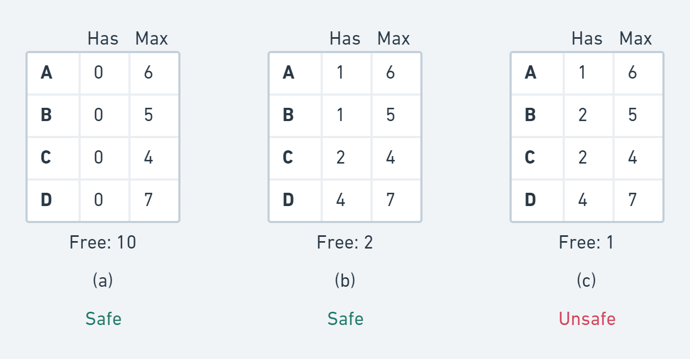

# Deadlock

## Deadlocks

A deadlock is a state in which each member of a group waits for another member, including itself, to take action. It occurs among processes/threads who need to acquire resources in order to progress.

A set of processes is deadlocked if each process in the set is waiting for an event that only another process in the set can cause.

Assumptions:

* If a process is denied a resource, it is put to sleep
* Only single-threaded processes
* No interrupts possible to wake up a blocked process

### Deadlock vs Starvation

**Deadlock**: Process(es) waiting on events (resources) that will never happen. Can be system wide or just one process.

**Starvation**: Process(es) waiting for its turn but never comes.

Process could move forward, the resource or event might become available but this process may not be able to get access to it.

Such starvation is usually caused by certain policy. For example, a printing policy may always choose to print the smallest file available. Then now one process shows up with HUGE file. This process will not likely get to run if there's steady stream of smaller file jobs coming in.

### Resources

Resources are anything that must be acquired, used and released over the course of time. Could be hardware or software resources.

#### Preemptable and non-preemptable resources

* **Preemptable**: can be taken away from the process with no ill-effect
* **Non-preemptable**: cannot be taken away from the process without causing the computation to fail

#### Reusable and Consumable resources

* **Reusable**: can be safely used by only one process at a time and is not depleted by that use. e.g. processors, I/O devices, main and secondary memory, devices, and data structures such as files, databases and semaphores.
* **Consumable**: one that can be created (produced) and destroyed (consumed). e.g. interrupts, signals, messages and information in I/O buffers.

### Conditions for Resource Deadlocks

1. Each resource is either currently assigned to exactly one process or is available
2. Processes currently holding resources that were granted earlier can request new resources
3. Resources previously granted cannot be forcibly taken away from a process. They must be explicitly released by the process holding them.
4. There must be a circular chain of two or more processes, each of which is waiting for a resource held by the next member of the chain.

### Resource Allocation Graph

## How to Deal with Deadlocks

1. Just ignore the problem.
2. Let deadlocks occur, detect them, and take action.
3. Dynamic avoidance by careful resource allocation.
4. Prevention, by structurally negating one of the [four required conditions](deadlock.md#conditions-for-resource-deadlocks).

### The Ostrich Algorithm

The ostrich algorithm is a strategy of ignoring potential problems on the basis that they may be exceedingly rare. It is used when it is more cost-effective to allow the problem to occur than to attempt its prevention.

## Deadlock Detection

The system does not attempt to prevent deadlocks. It tries to detect it when it happens. Then it takes some actions to recover.

Several issues here:

* Deadlock detection with one resource of each type
* Deadlock detection with multiple resources of each type
* Recovery from deadlock

### Deadlock Detection: One Resource of Each Type

Construct a resource graph. If it contains one ore more cycles, a deadlock exists.

### Formal Algorithm to Detect Cycles in the Allocation Graph

For each node N in the graph do:

1. Initialize L to empty list and designate all arcs as unmarked
2. Add the current node to end of L. If the node appears in L twice then we have a cycle and the algorithm terminates
3. From the given node, pick any unmarked outgoing arc. If none is available, go to 5.
4. Pick an outgoing arc at random and mark it. Then follow it to the new current node and go to 2.
5. If the node is the initial node, then no cycles found and the algorithm terminates; Otherwise, we are in dead end. Remove that node and go back to the previous one. Go to 2.

### When to check for deadlocks?

* Check every time a resource request is made
* Check every k minutes
* When CPU utilization has dropped below a threshold

## Recovery from Deadlock

We have detected a deadlock, what next? We have some options: Recovery through preemption, recovery through rollback and recovery through killing process.

### Recovery Through Preemption

Temporary take a resource away from its owner and give it to another process.

Manual intervention may be required (e.g. in case of printer)

Highly dependent on the nature of the resource.

Recovering this way is frequently impossible.

### Recovery Through Rollback

Have processes **checkpointed** periodically.

**Checkpoint** of a process: its state is written to a file so that it can be restarted later.

In case of deadlock, a process that owns a needed resource is rolled back to the point before it acquired that resource.

### Recovery Through Killing Process

Kill a process in the cycle.

Can be repeated (i.e. kill other processes) until deadlock is resolved.

The victim can also be a process NOT in the cycle.

## Deadlock Avoidance

In most systems, resources are requested one at a time.

Resource is granted only if it is **safe** to do so.

### Safe and Unsafe States

A **state** is said to be **safe** if there is one scheduling order in which every process can run to completion even if all of theme suddenly request their maximum number of resources immediately.

An **unsafe** state is NOT a deadlock state.

For example, assume a total of 10 instances of the resources available:

### The Banker's Algorithm

The algorithm checks if granting the request leads to an unsafe state. If it does, the request is denied.

#### The main idea

The algorithm checks to see if it has enough resources to satisfy some customers.

If so, the process closest to the limit is assumed to be done and resources are back, and so on.

If all loans (resources) can eventually be repaid, the state is safe.

### Example

### Problems

Very nice theoretically, but practically useless.

* Processes rarely know in advance what their maximum resource needs will be.
* The number of processes is not fixed.
* Resources can suddenly vanish.

## Deadlock Prevention

Deadlock avoidance is essentially impossible.

If we can ensure that at least one of the four conditions of the deadlock is never satisfied, then deadlocks will be structurally impossible.

### Deadlock Prevention: Attacking the Mutual Exclusion

Can be done for some resources (e.g. the printer) but not all.

E.g. For printer, use spooling (Spooling is a process in which data is temporarily held to be used and executed by a device, program or the system.).

Words of wisdom:

* Avoid assigning a resource when that is not absolutely necessary.
* Try to make sure that as few processes as possible may actually claim the resource.

### Deadlock Prevention: Attacking the Hold and Wait Condition

Prevent processes holding resources from waiting for more resources. This requires all processes to request all their resources before starting execution.

A different strategy: require a process requesting a resource to first temporarily release all the resources it currently holds. Then tries to get everything it needs all at once.

### Deadlock Prevention: Attacking No Preemption Condition

Virtualizing some resources can be a good strategy. (e.g. virtualize a printer).

Not all resources can be virtualized. (e.g. records in a database)

### Deadlock Prevention: Attacking the Circular Wait Condition

Method 1: Have a rule saying that a process is entitled only to a single resource at a moment.

Method 2:

* Provide a global numbering of all resources.
* A process can request resources whenever they want to, but all requests must be done in numerical order.
* With this rule, resource allocation graph can never have cycles.

## Summary

| Condition        | Approach                              |
| ---------------- | ------------------------------------- |
| Mutual exclusion | Spool everything                      |
| Hold and wait    | Request all resources initially       |
| No preemption    | Take resources away / virtualize them |
| Circular wait    | Order resources numerically           |

## Conclusions

Deadlocks can occur on hardware/software resources.

OS needs to be able to:

* Try to avoid them if possible
* Detect deadlocks
* Deal with them when detected
