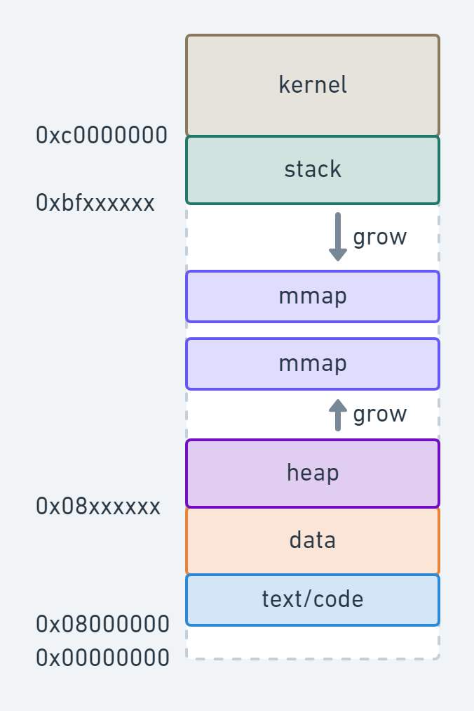

# Introduction

Operating systems turn ugly hardware into beautiful abstractions (arguable).

## Structure


## The Operating System as a Resource Manager

* Top down view: Provide abstractions to application programs
* Bottom up view: Manage pieces of complex systems (hardware and events)
* Alternative view: Provide orderly, controlled allocation of resources

## Two Main Tasks of OS

* Provide programmers (and programs) a clean set of abstract resources and services to manipulate these resources. How? -> System Call
  * Abstraction, simplification, standardization
* Manage the hardware resources
  * Allocation, protection, reclamation, virtualization

## Resources and Services

Resources: Allocation, Protection, Reclamation and Virtualization

Services: Abstraction, Simplification, Convenience and Standardization

### Operating System Short Explanation

OS (kernel) is really just a program that runs with special privileges to implement the features of allocation, protection, reclamation and virtualization and the services that are structured on top of it.

## Booting Sequence

* BIOS starts: checks how much RAM, keyboard, other basic devices
* BIOS determines boot Device
* The first sector in boot device is read into memory and executed to determine active partition
* Secondary boot loader is loaded from that partition
* This loaders loads the OS from the active partition and starts it.

## OS Services

* Program development
* Program execution
* Access I/O devices
* Controlled access to files
* System access
* Error detection and response
* Accounting

## Operating System Jungle / Zoo

* Mainframe operating systems
* Server operating systems
* Multiprocessor operating systems
* Personal computer operating systems
* Real-time operating systems
* Embedded operating systems
* Smart card operating systems
* Cellphone/tablet operating systems
* Sensor operating systems

## Processors

Each CPU has a specific set of instructions, ISA (Instruction Set Architecture) largely epitomized in the assembler

* RISC: Sparc, MIPS, PowerPC
* CISC: x86, zSeries

All CPUs contain:

* **General registers**: inside to hold key variables and temporary results
* **Special registers**: visible to the programmer
  * Program counter contains the memory address of the next instruction to be fetched
  * Stack pointer points to the top of the current stack in memory
  * PSW (Program Status Word) contains the condition code bits which are set by comparison instructions, the CPU priority, the mode (user or kernel) and various other control bits

### How Processors Work

Execute instructions in CPU cycles.

* Fetch(from mem) → decode → execute
* Program counter (PC)
* Pipeline: fetch n+2 while decode n+1 while execute n

### CPU Caches

Principle:

* Data/Instruction that were recently used are “likely” used again in short period
* Caching is principle used in “many” subsystems ( I/O, filesystems, … ) \[ hardware and software]

Cache hit: no need to access memory

Cache miss: data obtained from mem, possibly update cache

Issues:

* Operation MUST be correct
* Cache management for Memory done in hardware
* Data can be in read state in multiple caches but only in one cache when in write state

## OS Major Components

* Process and thread management
* Resource management
  * CPU
  * Memory
  * Device (I/O)
* File system
* Bootstrapping

## Process: a running program

A process includes:

* Address space
* Process table entries (state, registers): Open files, thread(s) state, resources field

A process tree:

* A created two child processes, B and C
* B created three child processes, D, E and F

```
     A
   /   \
   B    C
 / | \
 D E F
```

## Address Space

* Defines where sections of data and code are located in 32 or 64 address space.
* Defines protection of such sections: ReadOnly, ReadWrite, Execute
* Confined "private" addressing concept: requires form of address virtualization



## CPU Execution Modes

Two modes of CPU:

* **Kernel mode** (all instructions) aka privileged / supervisor mode
* **User mode** (a subset of instructions) aka unprivileged / problem mode: limits (\~excludes) user from accessing critical resources

How to switch between the two modes:

* UserMode → KernelMode
  * Trap
  * Interrupt (also Kernel2Kernel)
  * Exception (also Kernel2Kernel)
* KernelMode → UserMode
  * rfi (return from interrupt, also Kernel2Kernel)

### Interrupt / Exception / Trap

* Interrupts: **asynchronously** triggered by an event from a "device" (device needs attention)
* Exceptions: **synchronously** triggered by a "fault condition" of an instruction condition
* Traps (instruction, aka sc \[system call], special kind of exception): **synchronously** triggered by "trap instruction" for syscall

They all end up in the so called "interrupt handler":

> `__entry` is the **ONLY** means to enter into the operating system kernel. Either by
>
> * hw-interrupt
> * exception
> * trap

* assembler code aka `__entry` in the kernel
* from there the assembler identifies whether an interrupt, exception, or trap and jumps to their respective handlers.
* Protected Hardware register is initialized in OS bootstrap with the address of `__entry` so the hardware knows where to jump to when an Interrupt or Trap or Exception is raised.

## System Calls

* Invoked via non-privileged instruction (trap / sc): Treated often like an interrupt, but its "somewhat" different
* Synchronous transfer control from user to kernel
* Side-effect of executing a trap in userspace is that an “exception” is raised and program execution continues at a prescribed instruction in the kernel see `__entry` -> syscall\_handler

### Service Requests from user to kernel (OS) = System Calls

* Basic means to request services from the operating system kernel is to make **system calls** (which end up in a “trap / sc” event)
* It’s a well architected and “secure” API between kernel and userspace

### How are syscalls implemented

* First, one has to understand how arguments in any regular function call are passed.
* For this a **calling code convention** is defined.
* Typically arguments are passed through registers (sometimes as offsets on the stack)
* Those registers can be modified by the function called, any other registers most be saved and restored by the callee function: Volatile register (args,stackptr) and non-volative registers (callee must save and restore)
* Generally referred to as ABI: **Application Binary Interface**
* Syscalls are simply an extension on this. All compilers need to agree on this or code will no cooperate/work.

#### User Side

syscall is implemented as assembler largely taking the arguments already in the right registers and TRAP-ing into the kernel.

#### Kernel Side

* Kernel defines a table (using the compiler help)
* On system trap, architecture automatically and immediately enters kernel mode and runs a small piece of assembler code that is stored at a machine register address set by the OS at boot time.
* Said trap assembler code (aka interrupt handler) does the following:
  * Checks the syscall number in well known register (see ABI) to be in range
  * Assembler equivalent:
    * Change stack to kernel (more on this in a bit)
    * All arguments are already in right place thanks to the ABI and the compiler’s help -
    * `call/jmp` to `syscall_table[registers.syscall_number]; // see ABI definition`
    * After return from ^^^^, switch back from kernel stack to user stack and RFI (return from kernel mode).

## Other Implicit/Explicit OS Services Examples

Services that can be provided at user level (because they only read unprotected data):

* Read time of the day

Services that need to be provided at kernel level:

* System calls: file open, close, read and write
* Control the CPU so that users won’t stuck by running `while ( 1 );`
* Protection:
  * Keep user programs from crashing OS
  * Keep user programs from crashing each other

## Criteria to Evaluate OS

* Portability
* Security
* Fairness
* Robustness
* Efficiency
* Interfaces

Not all of these can be satisfied at the same time.
