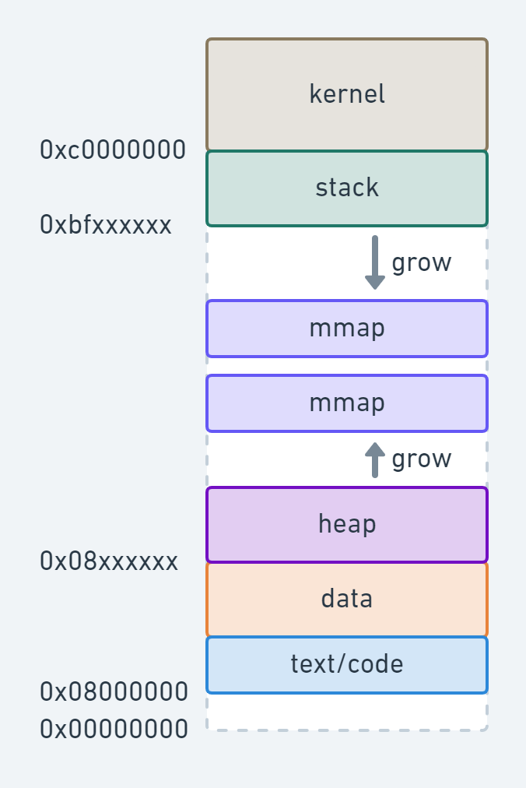
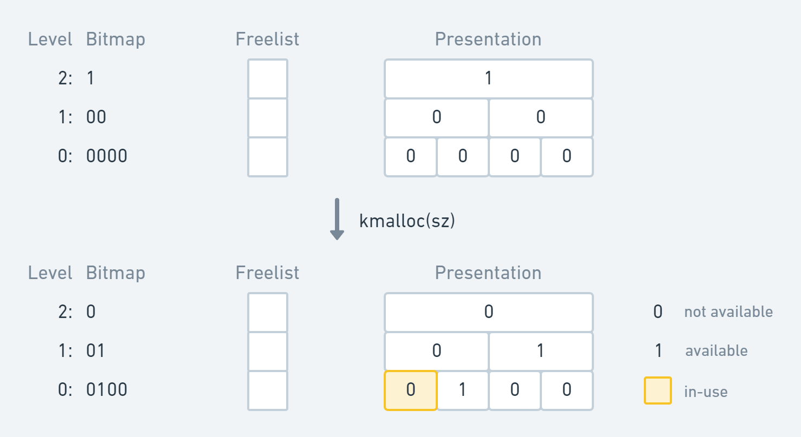
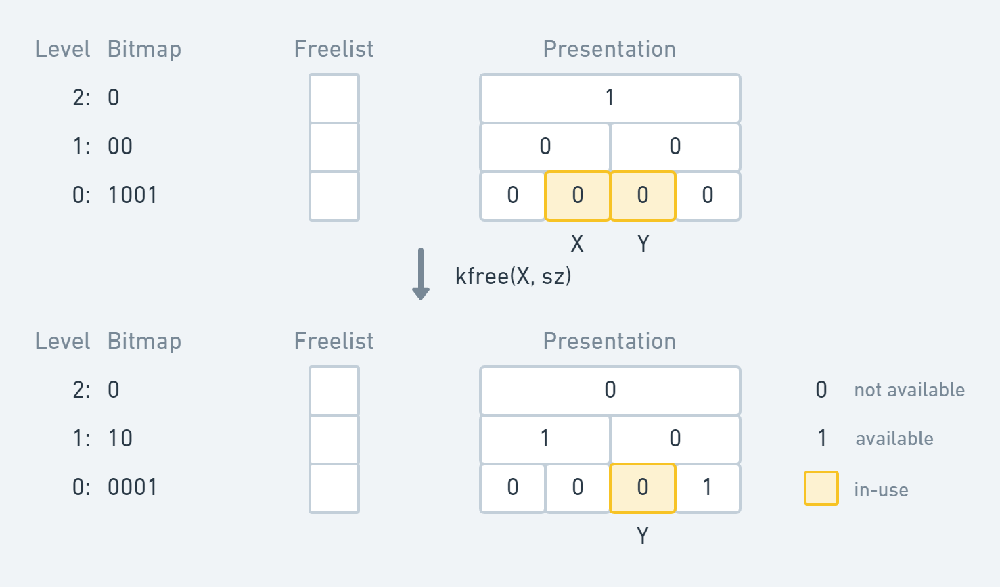

# Memory Management

## What if there's no memory abstraction?

Processes access physical memory directly, so they need to be relocated in order
to not overlap in physical memory.

Can be done at program load time, but it is a bad idea:

- very slow
- Require extra info from program

## Memory Abstraction

To allow several programs to co-exist in memory we need:

- Protection
- Relocation
- Sharing
- Logical organization
- Physical organization

For that, we have a new abstraction for memory: Address Space

## Address Space

Address Space: set of addresses that a process can use to address memory

- Defines where sections of data and code are located in 32 or 64 address space.
- Defines protection of such sections: ReadOnly, ReadWrite, Execute.
- Confined "private" addressing concept: requires form of address
  virtualization.

### Base and Limit

Map each process address space onto a different part of physical memory.

Two registers: Base and Limit.

- Base: start address of a program in physical memory.
- Limit: length of the program

Only OS can modify Base and Limit.

#### Add and Compare

For every memory access:

- Base is added to the address.
- Result is compared to Limit.

This can be done in hardware. So it doesn't significantly add to latency.

## Swapping

- Programs move in and out of memory
- **Holes** are created
- Holes can be combined → **memory compaction**
- What if a process needs more memory?
  - If a hole is adjacent to the process, it is allocated to it
  - Process has to be moved to a bigger hole
  - Process suspended till enough memory is there

## Managing Free Memory

**Bitmap** and **Linked List** are universal methods used in OS and
applications. Other methods employ Heaps.

Bitmap is slow to find k-consecutive 0s for a new process.

Linked List method consists of allocated and free memory segments. It is more
convenient to use **double-linked** lists.

## Buddy Algorithm

Considers blocks of memory only as 2^N.

Potential for fragmentation (drawback).

If no block of a size is available, it splits higher blocks into smaller blocks.

Easy to implement and fast: `O(log2(MaxBlockSz/MinBlockSz))` e.g. 4K .. 128B =
2^(12-7) = 2^(5 steps)

### Examples

