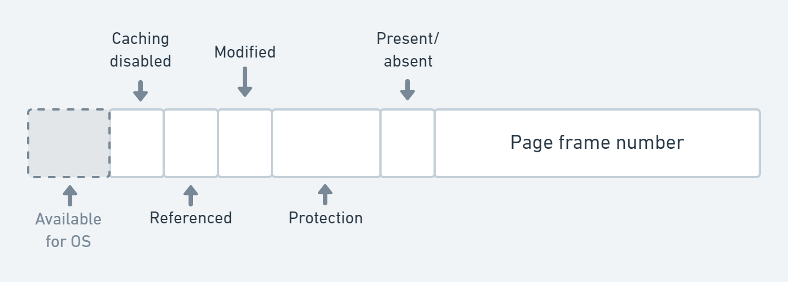
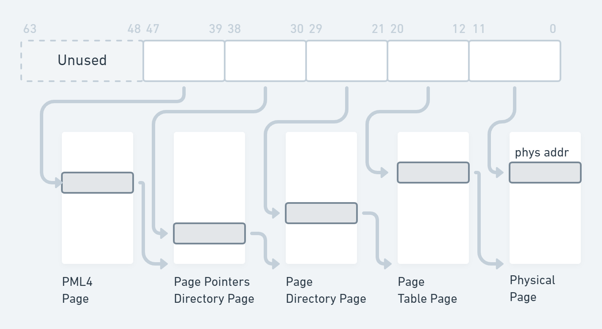
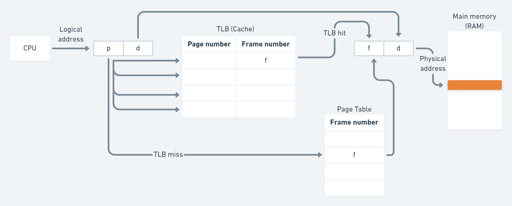
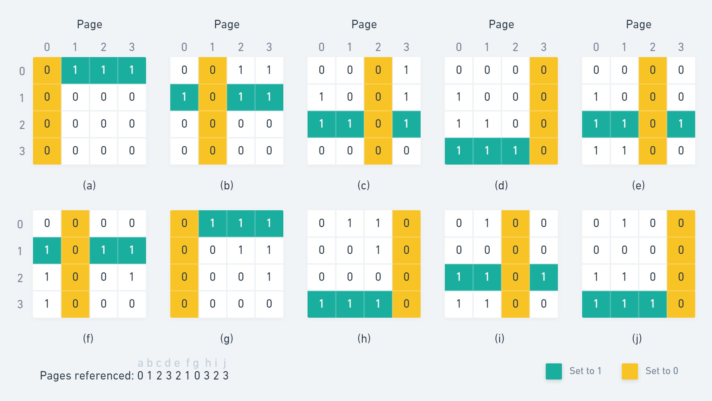

# Memory Management

## What if there's no memory abstraction?

Processes access physical memory directly, so they need to be relocated in order
to not overlap in physical memory.

Can be done at program load time, but it is a bad idea:

- very slow
- Require extra info from program

## Memory Abstraction

To allow several programs to co-exist in memory we need:

- Protection
- Relocation
- Sharing
- Logical organization
- Physical organization

For that, we have a new abstraction for memory: Address Space

## Address Space

Address Space: set of addresses that a process can use to address memory

- Defines where sections of data and code are located in 32 or 64 address space.
- Defines protection of such sections: ReadOnly, ReadWrite, Execute.
- Confined "private" addressing concept: requires form of address
  virtualization.


### Base and Limit

Map each process address space onto a different part of physical memory.

Two registers: Base and Limit.

- Base: start address of a program in physical memory.
- Limit: length of the program

Only OS can modify Base and Limit.

#### Add and Compare

For every memory access:

- Base is added to the address.
- Result is compared to Limit.

This can be done in hardware. So it doesn't significantly add to latency.

## Swapping

- Programs move in and out of memory
- **Holes** are created
- Holes can be combined → **memory compaction**
- What if a process needs more memory?
  - If a hole is adjacent to the process, it is allocated to it
  - Process has to be moved to a bigger hole
  - Process suspended till enough memory is there

## Managing Free Memory

**Bitmap** and **Linked List** are universal methods used in OS and
applications. Other methods employ Heaps.

Bitmap is slow to find k-consecutive 0s for a new process.

Linked List method consists of allocated and free memory segments. It is more
convenient to use **double-linked** lists.

## Buddy Algorithm

Considers blocks of memory only as 2^N.

Potential for fragmentation (drawback).

If no block of a size is available, it splits higher blocks into smaller blocks.

Easy to implement and fast: `O(log2(MaxBlockSz/MinBlockSz))` e.g. 4K .. 128B =
2^(12-7) = 2^(5 steps)

### Examples


## What are really the problems?

- Memory requirement unknown for most apps.
- Not enough memory: Having enough memory is not possible with current
  technology. How do you determine “enough”?
- Exploit and enforce one condition: Processor does not execute or access
  anything that is not in the memory (how would that even be possible ?) Enforce
  transparently (user is not involved)

## Memory Management Techniques

Memory management brings processes into main memory for execution by the
processor

- involves virtual memory
- based on paging and segmentation

But we can see that...

- All memory references are **logical addresses** in a process’s **address
  space** that are dynamically translated into physical addresses at run time
- An address space may be broken up into a number of pieces that don’t need to
  be contiguously located in main memory during execution.

So it is not necessary that all of the pieces of an address space be in main
memory during execution. Only the ones that I am “currently” accessing

## Virtual Memory

- Each program has its own **address space**
- This address space is divided into **pages** (e.g 4kB)
- Pages are mapped into physical memory chunks (called **frames**)
- By definition then `sizeof(page) == sizeof(frame)` (the size is determined by
  the hardware manufacturer)

### Secondary Storage

Main memory can act as a cache for the secondary storage (disk)

Advantages:

- illusion of having more physical memory
- program relocation
- protection

### Page Table Entry



**Present bit**: '1' if the values in this entry is valid, otherwise translation
is invalid and an pagefault exception will be raised

**Frame Number**: this is the physical frame that is accessed based on the
translation.

**Protection bits**: 'kernel' + 'w' specifies who and what can be done on this
page if kernel bit is set then only the kernel can translate this page. If user
accesses the page a 'privilege exception' will be raised. If _writeprotect_ bit
is set the page can only be read (load instruction). If attempted write (store
instruction), a write protection exception is raised.

**Reference bit**: every time the page is accessed (load or store), the
reference bit is set.

**Modified bit**: every time the page is written to (store), the modified bit is
set.

**Caching Disabled**: required to access I/O devices, otherwise their content is
in cpu cache

### Multi-Level Page Table / RadixTree / Hierarchical Page Table

To reduce storage overhead in case of large memories.

For sparse address spaces (most processes) only few 2nd tables required

#### 4 Level PageTable for 64-bit arch

OS has to make sure no segment is allocated into high range of address space
(63-48 bits). If bits are set, the MMU will raise an exception (this is really
an OS bug then).



### General Formula of PageTable Management

The OS must create its page table and VMM management following the hardware
definition.

- Hardware defines the frame size as 2^N
- (virtual) page size is typically equal frame size (otherwise it's a
  power-of-two multiple, but that is rare and we shall not base on this
  exception)
- Everything the OS manages is based on pagesize (hence framesize)
- You can compute all the semantics with some basic variables defined by the
  hardware:
  - Virtual address range (e.g. 48-bit virtual address, means that the hardware
    only considers the 48-LSB bits from an virtual address for ld/st, all others
    raise a SEGV error)
  - Frame size
  - PTE size (e.g. 4byte or 8byte)
  - From there you can determine the number of page table hierarchies, offsets
- Examples:
  - `Framesize = 4KB` → 12bit offset to index into frame (12bits)
  - `PTE size = 8Bytes` → 512 entries in each page table hierarchy
    (9bits/hierarchy)
  - `Virtual address range = 48bits` → `12 + N*9 = 48` (N=4)
  - The hardware does all the indexing as described before

## Speeding Up Paging

Challenges:

- Mapping virtual to physical address must be fast: we can not always traverse
  the page table to get the VA -> PA mapping <br> **Solution**: Translation
  Lookaside Buffer(TLB)
- If address space is large, page table will be large (but remember the
  sparsity, not fully populated) <br> **Solution**: Multi-level page table

## TLB

> Observation: most programs tend to make a large number of references to a
> small number of pages over a period of time -> only fraction of the page table
> is heavily used ( data and instruction locality !!!)

TLB is the hardware cache inside the MMU. It caches PageTable translations (VA
-> PA) and maps virtual to physical address without going to the page table
(unless there’s a miss).

In case of TLB miss -> MMU accesses page table and load entry from pagetable to
TLB. TLB misses occur more frequently than page faults.

### TLB Management

- TLB entries are not written back on access, just record the R and M bits in
  the PTE (it is a cache after all) upon access
- On TLB capacity miss, if the entry is dirty, write it back to its associated
  PageTableEntry (PTE)
- On changes to the PageTable, potential entries in the TLB need to be flushed
  or invalidated
  - "TLB invalidate" e.g. when mmap area disappears
  - "TLB flush" write back when changes in TLB to PageTable (either global or
    per address) must be recorded, think when a “TLB invalidate” might be
    insufficient

### TLB based translation



### Shared Pages (efficient usage of memory)

Shared code:

- One copy of read-only (reentrant) code shared among processes (i.e., text
  editors, compilers, window systems)
- Similar to multiple threads sharing the same process space
- Also useful for inter-process communication if sharing of read-write pages is
  allowed

Private code and data:

- Each process keeps a separate copy of the code and data
- The pages for the private code and data can appear anywhere in the logical
  address space

### Copy on Write (COW)

**Copy-on-Write (COW)** allows both parent and child processes to initially
**share** the same pages in memory. If either process modifies a shared page,
only then is the page copied

COW allows more efficient process creation as only modified pages are copied

- In general, free pages are allocated from a pool of zero-fill-on-demand pages

  - Pool should always have free frames for fast demand page execution: Don’t
    want to have to free a frame when one is needed for processing on page fault
  - Why zero-out a page before allocating it? -> so we get a known state of a
    page.

- `vfork()` variation on `fork()` system call has parent suspend and child using
  copy-on-write address space of parent
  - Designed to have child call `exec()`
  - Very efficient

## Page Replacement Algorithms

### Optimal Page Replacement Algorithm

Each page labeled with the number of instructions that will be executed before
this page is referenced.

Page with the highest label should be removed.

Impossible to implement (just used for theoretical evaluations)

### The FIFO Replacement Algorithm

- OS maintains a list of the pages currently in memory [that would be for
  instance frame table]
- The most recent arrival at the tail
- On a page fault, the page at the head is removed
- In lab3: for simplicity you implement FIFO with a simple round robin using a
  `HAND == pointer` to the frametable

### The Second-Chance Page Replacement Algorithm

- Modification to FIFO
- Inspect the R bit of the oldest page
  - If R=0 page is old and unused -> replace
  - If R=1 then
    - bit is cleared
    - page is put at the end of the list
    - the search continues
- If all pages have R=1, the algorithm degenerates to FIFO

### The Clock Page Replacement Policy

Keep page frames on a circular list in the form of a clock

The hand points to the oldest uninspected page

When page fault occurs

- The page pointed to by the hand is inspected
- If R=0
  - page evicted
  - new page inserted into its place
  - hand is advanced
- If R=1
  - R is set to 0
  - hand is advanced

This is essentially an implementation of 2nd-Chance

### The Clock Page Replacement Policy (an optimization)

When a page fault occurs, the page the hand is pointing to is inspected. The
action taken depends on the R bit:

- `R = 0`: Evict the page
- `R = 1`: Clear R and advance hand

Tail moves in front and “processes” candidates, writing optimistically modified
pages back to swap and clear “M” bit and R bit

### The Not Recently Used (NRU) Replacement Algorithm / Enhanced Second Chance Algorithm

Two status bits with each page

- R: Set whenever the page is referenced (used)
- M: Set when the page is written / dirty

R and M bits are available in most computers implementing virtual memory

Those bits are updated with each memory reference

- Must be updated by hardware
- Reset only by the OS

Periodically (e.g. on each clock interrupt) the R bit is cleared

- To distinguish pages that have been referenced recently

| Class | R   | M   |
| ----- | --- | --- |
| 0     | 0   | 0   |
| 1     | 0   | 1   |
| 2     | 1   | 0   |
| 3     | 1   | 1   |

### The Least Recently Used (LRU) Page Replacement Algorithm

Good approximation to optimal. When page fault occurs, replace the page that has
been unused for the longest time. Realizable but **not cheap**.

Slow + Few machines (if any) have required hardware.

#### Hardware Implementation 1

- 64-bit counter increment after each instruction
- Each page table entry has a field large enough to include the value of the
  counter
- After each memory reference, the value of the counter is stored in the
  corresponding page entry
- At page fault, the page with lowest value is discarded

Too expensive! Too slow!

#### Hardware Implementation 2

- Machine with n page frames
- Hardware maintains a matrix of n x n bits
- Matrix initialized to all 0s
- Whenever page frame k is referenced:
  - Set all bits of row k to 1
  - Set all bits of column k to 0
- The row with lowest value is the LRU



#### Hardware Implementation 3

Maintain the LRU order of accesses in frame list by hardware

```
Head: 4 <-> 2 <-> ... <-> 7 <-> 3 <-> 5
```

After accessing page 3:

```
Head: 3 <-> 4 <-> 2 <-> ... <-> 7 <-> 5
```

#### Approximating LRU in Software

- Not Frequently Used (NFU) algorithm
- Software counter associated with each page, initially zero
- At some periodicity (e.g. a second), the OS scans all page table entries and
  adds the R bit to the counter of that PTE
- At page fault: the page with lowest counter is replaced

Still a lot of overhead ( not really practical either)

### Aging Algorithm

NRU never forgets anything -> high inertia

Modifications:

- shift counter right by 1
- add R bit as the leftmost bit
- reset R bit

This modified algorithm is called aging.Each bit in vector represents a period.
The page whose counter is lowest is replaced at page replacement

## OS Involvement With Paging

### When a new process is created

- Determine how large the program and data will be (initially)
- Create page table
- Allocate space in memory for page table
- Record info about page table and swap area in process table

### When a process is scheduled for execution

- TLB flushed for current process
- MMU reset for the process
- Process table of next process made current

### When process exits

- OS releases the process page table
- Frees its pages and disk space

### When page fault occurs: Page Fault Exception Handling

1. The hardware:

   - Saves program counter
   - Exception leads to kernel entry

2. An assembly routine saves general registers and calls OS.
3. OS tried to discover which virtual page is needed
4. OS checks address validation and protection and assign a page frame (page
   replacement may be needed)
5. If page frame selected is dirty

   - Page scheduled to transfer to disk
   - Frame marked as busy
   - OS suspends the current process
   - Context switch takes place

6. Once the page frame is clean
   - OS looks up disk address where needed page is
   - OS schedules a disk operation
   - Faulting process still suspended
7. When disk interrupts indicates page has arrived
   - OS updates page table
8. Faulting instruction is backed up to its original state before page fault and
   PC is reset to point to it.
9. Process is scheduled for execution and OS returns to the assembly routine.
10. The routine reloads registers and other state information and returns to
    user space.

### Virtual Memory & I/O Interaction (Interesting Scenario)

Process issues a `syscall()` to read a file into a buffer, the process suspended
while waiting for I/O. New process starts executing, this other process gets a
page fault. If paging algorithm is global there is a chance the page containing
the buffer could be removed from memory, the I/O operation of the first process
will write some data into the buffer and some other on the just-loaded page !

One solution: **Locking** (**pinning**) pages engaged in I/O so that they will
not be removed by replacement algo

### Backing Store

Swap area: not a normal file system on it.

Associates with each process the disk address of its swap area; store in the
process table

Before process starts swap area must be initialized

- One way: copy all process image into swap area [static swap area]
- Another way: don’t copy anything and let the process swap out [dynamic]

Instead of disk partition, one or more preallocated files within the normal file
system can be used [Windows uses this approach.]

### Memory Mappings

Each process consists of many memory areas, aka:

- segments
- regions
- VMAs virtual memory areas.
- Examples: Heap, stack, code, data, ronly-data, etc.

Each has different characteristics

- Protection (executable, rw, rdonly)
- Fixed, can grow (up or down) [heap, stack]

Each process can have 10s-100s of these.

### Memory Mapped Files

Maps a VMA -> file segment (see `mmap()`'s `fd` argument )

- It’s contiguous
- On PageFault, it fetches the content from file at the appropriate offset into
  a virtual page of the address space
- On "swapout", writes back to file (different versions though)

Benifits: Can perform load/store operations vs input/output

## Organization of Memory Regions

- Cells are by default non-overlapping. Called VMA (Virtual Memory Areas)
- Organized as AVL trees
- Identify in O(logN) time during pgfault: `Pgfault(vaddr)` → VMA
- Rebalanced when VMA is added or deleted

## VMA organization

- Organized as balanced tree
- Node [ start - end ]
- On add/delete: rebalance
- Lookup in `O(log(n))` time
