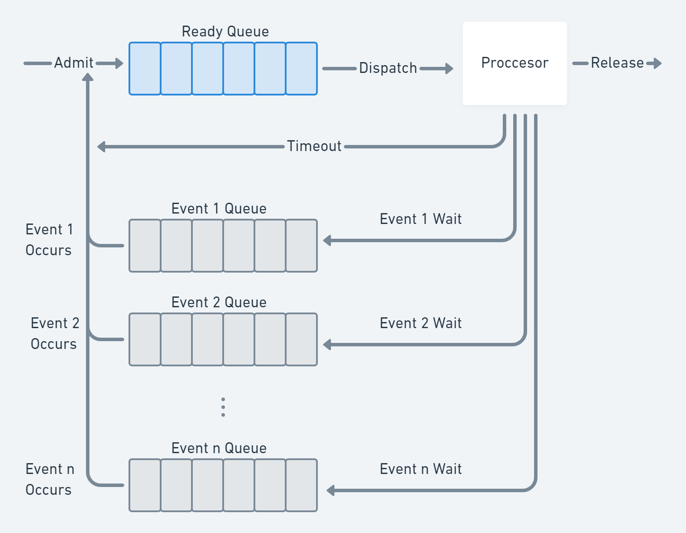

# Processes and Threads

A "processor" can only run one unit of execution (process/thread) at a time. The
processor is switched (context switch) among multiple applications so all will
appear to be progressing (albeit potentially at reduced speed). The processor
and I/O devices can be used efficiently: When application performs I/O, the
processor can be used for a different application.

## What is a process?

An abstraction of a running program.

### The Process Model

- A process has a program, input, output, and state (data).
- A process is an instance of an executing program and includes
  - Variables ( memory )
  - Code
  - Program counter ( really hardware resource)
  - Registers
  - ...

### Process: a running program

A process includes:

- Address space
- Process table entries (state, registers): Open files, thread(s) state,
  resources field

A process tree:

- A created two child processes, B and C
- B created three child processes, D, E and F

```
     A
   /   \
   B    C
 / | \
 D E F
```

### Address Space

- Defines where sections of data and code are located in 32 or 64 address space.
- Defines protection of such sections: ReadOnly, ReadWrite, Execute
- Confined "private" addressing concept: requires form of address virtualization


### Process Creation

- System initialization
  - At boot time
  - Foreground
- Background (daemons)
- Execution of a process creation system call by a running process
- A user request
- A batch job
- Created by OS to provide a service
- Interactive login

### Process Termination

- Normal exit (voluntary)
- Error exit (voluntary)
- Fatal error (involuntary)
- Killed by another process (involuntary)

## Implementation of Processes

- OS maintains a process table `Process procs[];`
- An array (or a hash table) of structures
- One entry per process (pid is the uniq id)

## Implementation of Processes: Process Control Block (PCB)

- Contains the process elements
- It is possible to interrupt a running process and later resume execution as if
  the interrupt had not occurred → state
- Created and managed by the operating system
- Key tool that allows support for multiple processes

Includes: Identifier, state, priority, program counter, memory pointers, context
data, I/O status information and accounting information.

## Fork

Creation of a new process by `fork()`. Executing a program in that new process.
Signal notifications.

The kernel boot manually creates ONE process (the init process, pid=0) and all
other processes are created by `fork()`.

### `fork()`

```c
#include <stdio.h>
#include <unistd.h>
int main(int argc, char **argv) {
  pid_t pid = fork(); // syscall that creates new PCB and duplicates Address Space
  if (pid == 0) {
    // child process
  } else if (pid > 0) {
    // parent process
  } else {
    // fork failed
    printf("fork() failed!\n");
    return 1;
  }
}
```

### `execv()`

The `exec()` family of functions replaces the current process image with a new
process image.

## Process State Model: Five-State Model


### Using Queues to Manage Processes




## Multiprogramming

- One CPU and several processes
- CPU switches from process to process quickly

Running the same program several times will not result in the same execution
times due to:

- interrupts
- multi-programming

## Concurrency vs. Parallelism

- Concurrency is when two or more tasks can start, run, and complete in
  overlapping time periods. It doesn't necessarily mean they'll ever both be
  running at the same instant. For example, multitasking on a single-core
  machine.
- Parallelism is when tasks literally run at the same time, e.g., on a multicore
  processor.

## Threads

- Multiple threads of control within a process: unique execution
- All threads of a process share the same address space and resources (with
  exception of stack)

### Why Threads?

- For some applications many activities can happen at once:
  - With threads, programming becomes easier
    - Otherwise application needs to actively manage different logical
      executions in the process
    - This requires significant state management
  - Benefit applications with I/O and processing that can overlap
- Lighter weight than processes
- Can be used to implement concurrency
  - Faster to create and restore: we just really need a stack and an execution
    unit, but don't have to create new address space etc.

### Processes vs. Threads

- Process groups resources: Address Space, files
- Threads are entities scheduled for execution on CPU
- Threads can be in any of several states: running, blocked, ready, and
  terminated (remember the process state model?)
- No protections among threads (unlike processes) [Why?] → this is important

- The unit of dispatching is referred to as a
thread or lightweight process (lwp)
- The unit of resource ownership is referred
to as a process or task
(unfortunately in linux struct task
represents both a process and thread)
• Multithreading - The ability of an OS to
support multiple, concurrent paths of
execution within a single process
