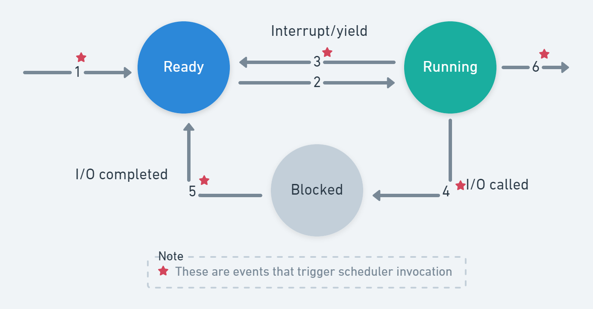

# Scheduling

Whether scheduling is based on processes or threads depends on whether the OS is
multi-threading capable: Given a group of ready processes or threads, which
process/thread to run?

## When to schedule?

- When a process is created
- When a process exits
- When a process blocks
- When an I/O interrupt occurs

## Categories of Scheduling Algorithms

- Interactive: preemption is essential, preemption is a means ofr the OS to take
  away the CPU from a currently running process/thread
- Batch:
  - No user impatiently waiting
  - mostly non-preemptive, or preemptive with long period for each process
- Real-time: deadlines

### Scheduling Algorithms: Goals and Measures

- Turn Around Time (Batch)
- Throughput (e.g. Jobs per second)
- Response Time (Interactive)
- Average wait times (how long waiting in ready queue)

## CPU / IO Burst

**CPU Burst**: a sequence of instructions a process runs without requesting I/O.
Mostly dependent on the program behavior.

**IO "Burst"**: time required to satisfy an IO request while the Process can not
run any code. Mostly dependent on system behavior (how many other IOs, speed of
device, etc.)

## Scheduling Algorithms Goals

All systems

- Fairness: giving each process a fair share of the CPU
- Policy enforcement: seeing that stated policy is carried out
- Balance: keeping all parts of the system busy

Batch systems

- Throughput: maximize jobs per hour
- Turnaround time: minimize time between submission and termination
- CPU utilization: keep the CPU busy all the time

Interactive systems

- Response time: respond to requests quickly
- Proportionality: meet users'expectations

Real-time systems

- Meeting deadlines: avoid losing data
- Predictability: avoid quality degradation in multimedia systems

## Process State Transition

Almost ALL scheduling algorithms can be described by the following process state
transition diagram or a derivative of it (we covered some more sophisticated one
in prior lecture)

